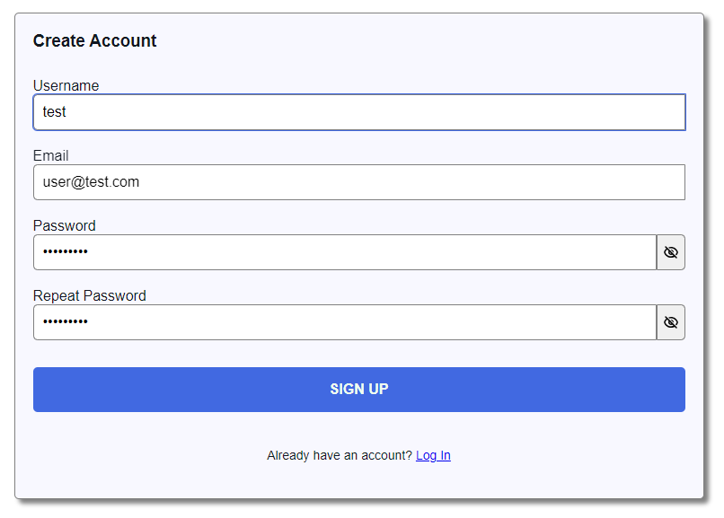

# ReactJS Signup Form

A user-friendly signup form built with React.js. This project demonstrates form handling, validation, and state management in React.

## Screenshot

  <!-- Replace with the path to your screenshot image -->

## Live Demo

You can try out the live demo of this project [here](https://reactjs-signup-form-weld.vercel.app/).

## Features

- Input validation
- Error messages for invalid inputs
- Responsive design
- Basic form submission handling

## Installation

To get started with the project locally, follow these steps:

1. **Clone the repository:**

    ```bash
    git clone https://github.com/EthanEDev/reactjs-signup-form.git
    ```

2. **Navigate to the project directory:**

    ```bash
    cd reactjs-signup-form
    ```

3. **Install dependencies:**

    ```bash
    npm install
    ```

4. **Start the development server:**

    ```bash
    npm start
    ```

    The application should now be running on [http://localhost:3000](http://localhost:3000).

## Usage

Once the application is running, you can use the following features:

- **Form Fields**: Fill out the fields for username, email, and password.
- **Validation**: See real-time validation and error messages for incorrect inputs.
- **Submit**: Click the "Submit" button to process the form.

## Technologies Used

- React.js
- JavaScript (ES6+)
- CSS

## Contributing

Contributions are welcome! If you have suggestions for improvements or find bugs, please open an issue or submit a pull request.

1. Fork the repository.
2. Create a new branch (`git checkout -b feature-branch`).
3. Commit your changes (`git commit -am 'Add new feature'`).
4. Push to the branch (`git push origin feature-branch`).
5. Create a new Pull Request.

## License

This project is licensed under the MIT License - see the [LICENSE](LICENSE) file for details.

## Contact

If you have any questions, feel free to reach out to me via GitHub issues or at [ethan.ekhtiyar@gmail.com](mailto:ethan.ekhtiyar@gmail.com).
